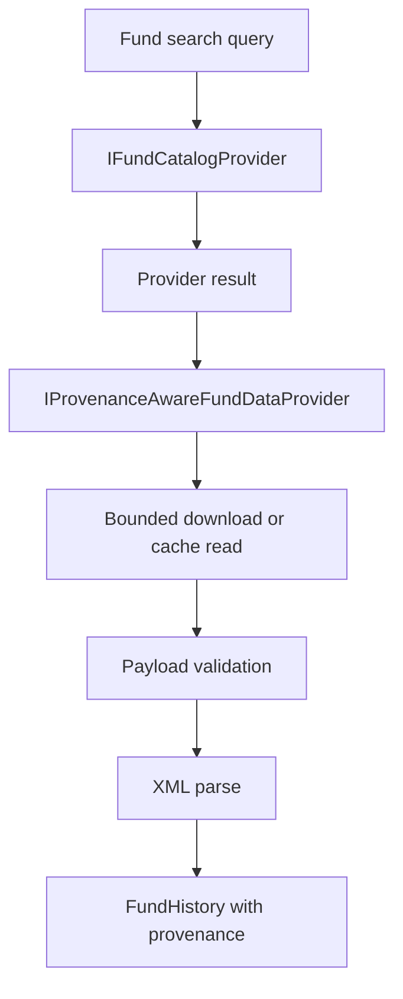

# Data Layer

`Aletheia.Data` owns source-specific data ingestion and provider safety.

## Responsibilities

- read local CSV files;
- generate deterministic sample data;
- search CNMV IIC fund catalogs;
- load provider-backed fund NAV histories;
- validate provider payloads;
- preserve provenance and cache metadata;
- detect observation frequency;
- run data-quality diagnostics.

## Provider Flow

## CNMV IIC Provider

The CNMV provider reads official monthly ZIP publications and extracts registration and daily NAV
fields for exact ISIN matches. The provider follows redirects, validates content type and ZIP
signatures, applies size and ratio limits, disables XML DTD processing, and records cache state.

## Boundaries

Aletheia does not infer missing provider values. It preserves reported observation dates and
separates source observation counts from any effective analysis counts.

## Source and Tests

- Source: `src/Aletheia.Data`
- Tests: `tests/Aletheia.Data.Tests`

Related detail: [Data Provenance](data-provenance.md).
