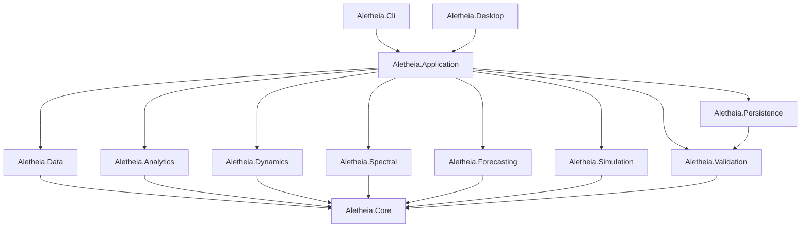
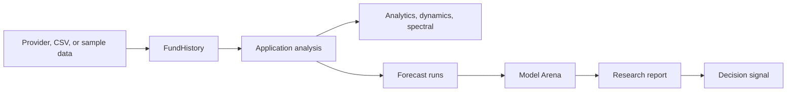

# Architecture Overview

Aletheia uses a layered architecture: pure domain and numerical logic sit near the center, while data
providers, application orchestration, CLI, desktop UI, and persistence sit near the edge.

## Dependency Direction

## Design Principles

- Domain types carry explicit units and identities.
- Mathematical values avoid ambiguous names when units matter.
- I/O and provider parsing are kept out of UI code.
- CLI and desktop share the same application use cases.
- Forecasts are separated from validation and from decision language.
- Prediction records are immutable; realized outcomes are separate evaluations.

## Main Runtime Flow

For the detailed historical note, see [Detailed Architecture](../architecture.md).
