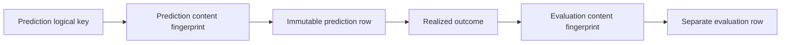

# Reproducibility

Aletheia records enough metadata to make analyses inspectable and repeatable when the same code,
inputs, options, and data payloads are available.

## Version Identifiers

| Identifier | Value | Purpose |
| --- | --- | --- |
| Product version | `2.7.3` | User-facing package/application version. |
| Scientific version | `2.12.0-causal-horizon-integrity` | Version stamped into scientific metadata and predictions. |

The central source is `src/Aletheia.Core/AletheiaRelease.cs`; package version is also set in
`Directory.Build.props`.

## Reproducibility Metadata

Aletheia tracks:

- dataset fingerprints;
- provider references and cache keys;
- model descriptors and configuration fingerprints;
- state-schema fingerprints;
- forecast horizon resolution;
- prediction content fingerprints;
- evaluation content fingerprints;
- deterministic seeds where stochastic simulations are used.

## Prediction Ledger Lifecycle

## What Reproducibility Does Not Prove

Reproducibility means the same analytical process can be inspected. It does not prove that the model
is economically useful or that a future market will behave like the sample.
