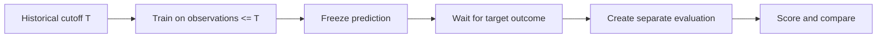

# Causality and Look-Ahead

Look-ahead bias occurs when a historical model run accidentally uses information that would not have
been available at the original decision date. Aletheia's scientific version
`2.12.0-causal-horizon-integrity` is focused heavily on this problem.

## Implemented Safeguards

| Risk | Boundary implemented in Aletheia |
| --- | --- |
| Future observations leaking into forecasts | Walk-forward training ends at the cutoff. |
| Label leakage in timing | Triple-barrier labels enter training only after their `EndIndex` is known. |
| Current external evidence backfilled into history | Missing historical spectral or ensemble evidence remains absent. |
| Horizon mismatch | Forecast and timing evidence is kept horizon-specific. |
| Smoothed state probabilities used historically | Timing features use filtered online HMM probabilities. |
| Future NAV mutation changing old forecasts | State-space tests assert cutoff immutability. |

## Validation Lifecycle

## Boundary of Protection

These safeguards protect the implemented univariate fund-history workflows. They do not solve every
research risk. Provider universe coverage, survivorship bias, strategy capacity, taxes, and external
market factors require independent analysis.

## Related Pages

- [Validation Philosophy](../validation/philosophy.md)
- [Market Timing](../market-timing.md)
- [Prediction Ledger Integrity](../architecture/prediction-ledger-integrity.md)
