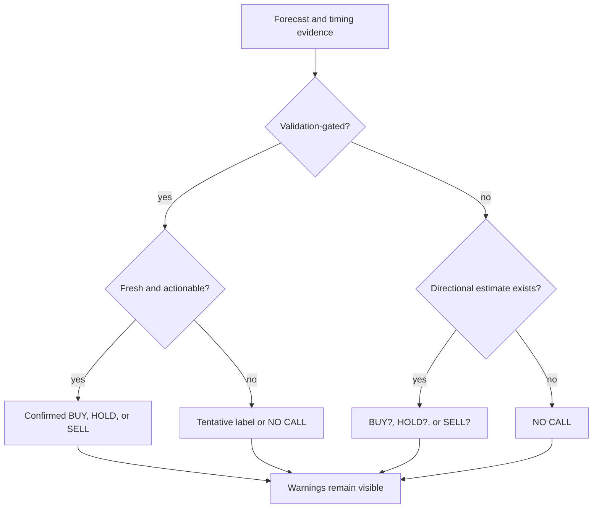

# Decision Signals

Aletheia's decision language is intentionally conservative. Signals summarize evidence; they are not
financial advice.

## Label Vocabulary

| Label | Meaning |
| --- | --- |
| `BUY` | Direction is buy/accumulate and validation/actionability gates are strong enough for a confirmed label. |
| `BUY?` | A buy direction exists, but evidence is tentative, stale, weak, mismatched, or otherwise not fully actionable. |
| `HOLD` | Evidence supports no change in exposure. |
| `HOLD?` | Evidence leans neutral/hold but is tentative or not fully actionable. |
| `SELL` | Direction is sell/reduce and validation/actionability gates are strong enough for a confirmed label. |
| `SELL?` | A sell direction exists, but evidence is tentative. |
| `NO CALL` | Aletheia cannot defend a directional conclusion from available evidence. |
| `NO RELIABLE SIGNAL` | CLI/report wording for an unvalidated or unavailable decision path. |
| `NO RELIABLE ECONOMIC BACKTEST` | Historical OOS timing signals were not sufficient for a defensible economic backtest. |
| `InsufficientEvidence` | Technical timing zone meaning the timing engine lacks enough validated evidence. |

## Decision Components

| Component | What it means | Common mistake |
| --- | --- | --- |
| Direction | Buy, hold, sell, or none. | Treating any direction as validated. |
| Qualification | Confirmed, tentative, or unavailable. | Ignoring the question mark. |
| Confidence | Presentation confidence around the signal. | Treating it as a performance guarantee. |
| ReliabilityIndex | Validation-support score for timing. | Reading it as probability of correctness. |
| Strategic attractiveness | Longer-horizon fund opportunity score. | Confusing it with tactical timing. |
| Tactical market timing | Current event probability assessment. | Treating it as a trade ticket. |
| Current actionability | Whether evidence is usable now. | Ignoring stale data or OOD warnings. |

## Compact Decision Table

| Evidence pattern | Typical visible result | Interpretation |
| --- | --- | --- |
| Validated ensemble, fresh data, sufficient reliability, clear positive edge | `BUY` | A confirmed research label may be shown, still not advice. |
| Directional forecast exists but validation is weak or absent | `BUY?` or `SELL?` | A tentative estimate, not a validated recommendation. |
| Evidence exists and is balanced | `HOLD` or `HOLD?` | No exposure change is supported, with qualification depending on evidence. |
| Forecasts are missing, contradictory, stale, or severe OOD | `NO CALL` | No defensible directional conclusion. |
| Timing validation exists but economic chain has too few historical decisions | `NO RELIABLE ECONOMIC BACKTEST` | Do not infer profitability. |

## Qualification Flow

## Related Pages

- [Decision Signals Science Note](../decision-signals.md)
- [Actionability](actionability.md)
- [Market Timing](../user-guide/market-timing.md)
