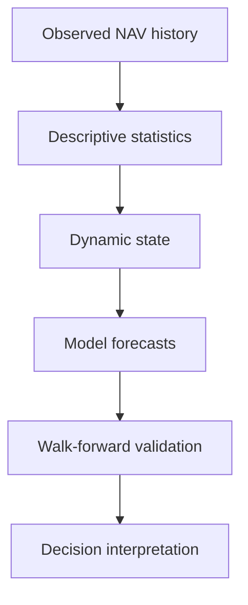

# Quantitative Foundations

Aletheia treats a fund as an observed financial time series. Most calculations start from dated NAV
observations and derive returns, risk, state variables, forecasts, and validation records.

## Core Ideas

| Concept | Plain-language meaning |
| --- | --- |
| NAV | The reported net asset value of the fund/share class at a date. |
| Return | The relative change between two NAV observations. |
| State | A vector of features describing the current time-series condition. |
| Forecast | A model output for a defined future horizon. |
| Validation | Historical out-of-sample testing of whether forecasts were useful. |
| Signal | A conservative interpretation layer over score, forecast, timing, and validation evidence. |

## Scientific Layers

Each layer can fail or abstain. Aletheia is intentionally allowed to say that the data does not
support a reliable conclusion.

## What Counts as Evidence

- mathematically valid calculations on loaded observations;
- explicit provenance and data-quality diagnostics;
- out-of-sample validation against realized future outcomes;
- baseline-relative model comparison;
- calibration and common-support diagnostics;
- economic backtests built only from historical out-of-sample timing decisions.

## What Does Not Count as Proof

- a good-looking chart;
- in-sample fit;
- a spectral peak without causal validation;
- a single backtest without realistic costs and delays;
- a high `ReliabilityIndex` treated as a probability of being correct.

See [Validation Philosophy](../validation/philosophy.md) for the scientific boundary.
