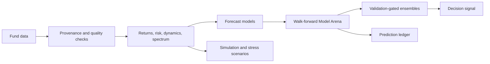

<section class="aletheia-hero">
  <div class="aletheia-kicker">ROOT / EIDO / MARKET_SIMULATOR</div>
  <h1>Aletheia</h1>
  <p class="aletheia-lede">
    Aletheia is an open-source quantitative fund analysis and forecasting platform for studying
    markets as stochastic dynamic systems. It combines fund data ingestion, time-series analytics,
    probabilistic forecasting, simulation, validation, and a native desktop research shell.
  </p>
  <div class="aletheia-version-strip">
    <span class="aletheia-chip">Product 2.7.3</span>
    <span class="aletheia-chip">Scientific 2.12.0-causal-horizon-integrity</span>
    <span class="aletheia-chip">MIT License</span>
  </div>
</section>

!!! danger "Quantitative research tool, not financial advice"
    Aletheia does not guarantee future performance, does not place trades, and does not replace
    professional investment advice. Its strongest outputs are evidence summaries. A reasonable
    reader should treat `BUY?`, `SELL?`, `NO CALL`, and `NO RELIABLE ECONOMIC BACKTEST` as explicit
    statements about uncertainty and validation limits.

<div class="aletheia-card-grid">
  <a class="aletheia-card" href="getting-started/overview.md">
    <h3>Use Aletheia</h3>
    <p>Install the toolchain, load the sample dataset, use the desktop shell, and run CLI workflows.</p>
  </a>
  <a class="aletheia-card" href="concepts/quantitative-foundations.md">
    <h3>Understand the Science</h3>
    <p>Read the assumptions, models, validation gates, probability language, and decision discipline.</p>
  </a>
  <a class="aletheia-card" href="architecture/overview.md">
    <h3>Explore the Architecture</h3>
    <p>Inspect source projects, data flow, reproducibility boundaries, and extension points.</p>
  </a>
</div>

## Feature Overview

<div class="aletheia-feature-grid">
  <div class="aletheia-feature"><strong>Fund discovery</strong><br />CNMV IIC search, exact ISIN history loading, bounded provider downloads, and source provenance.</div>
  <div class="aletheia-feature"><strong>Risk and performance</strong><br />Returns, volatility, drawdown, Sharpe, Sortino, rolling metrics, and data-quality diagnostics.</div>
  <div class="aletheia-feature"><strong>Dynamic states</strong><br />State vectors, volatility, momentum, acceleration, PCA support, Kalman, GARCH, and HMM diagnostics.</div>
  <div class="aletheia-feature"><strong>Forecasting</strong><br />Capability-declared model outputs over 30, 90, 180, and 365 calendar-day application horizons.</div>
  <div class="aletheia-feature"><strong>Model Arena</strong><br />Walk-forward model comparison on common support with simple baselines and typed failures.</div>
  <div class="aletheia-feature"><strong>Market timing</strong><br />Triple-barrier probabilities, causal features, calibration, reliability penalties, and economic backtesting.</div>
</div>

## Analytical Flow



## Quick Links

| Goal | Start here |
| --- | --- |
| Install and preview the sample workflow | [Installation](getting-started/installation.md) and [First Analysis](getting-started/first-analysis.md) |
| Interpret `BUY?`, `HOLD?`, `SELL?`, and `NO CALL` | [Decision Signals](concepts/decision-signals.md) and [Actionability](concepts/actionability.md) |
| Understand whether the science is rigorous | [Validation Philosophy](validation/philosophy.md), [Causality and Look-Ahead](concepts/causality-and-look-ahead.md), and [Limitations](validation/limitations.md) |
| Learn the models | [Models Overview](models/overview.md) and [Mathematical Notes](mathematics.md) |
| Build, test, or extend the code | [Repository Guide](development/repository-guide.md) and [Build and Test](development/build-and-test.md) |
| Publish this Wiki | [Documentation Site](reference/documentation-site.md) |

!!! example "Start with the sample dataset"
    ```powershell
    dotnet run --project src/Aletheia.Cli -- sample
    dotnet run --project src/Aletheia.Cli -- report sample
    dotnet run --project src/Aletheia.Desktop
    ```

## Current Maturity

Aletheia is a technically robust and scientifically grounded open-source MVP. It already contains
substantial analytical, validation, simulation, persistence, CLI, and WinForms desktop infrastructure.
It remains a research platform: claims about economic usefulness must be tested independently with
out-of-sample evidence, realistic execution assumptions, and a frozen holdout protocol.
