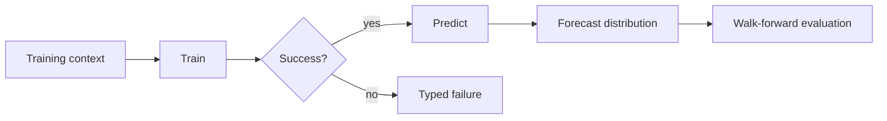

# Models Overview

Aletheia models are deliberately modular. Forecast models implement a common interface, declare their
capabilities, and are compared through validation before their evidence can influence confirmed
signals.

## Default Forecast Models

The application default set is created by `AletheiaApplicationService.CreateDefaultForecastModels`:

| Model | Role | Capabilities |
| --- | --- | --- |
| Zero Return | Point baseline | Point forecast |
| Historical Probability Climatology | Probability baseline | Positive-return probability |
| Historical Mean | Empirical horizon-return distribution | Point, expected return, median, probability, quantiles |
| AR(1) | Autoregressive log-return forecast | Point, expected return, median, probability, quantiles |
| State Space Local Linear | Kalman log-NAV forecast | Point, expected return, median, probability, quantiles, full distribution |
| Historical Analogues | Similar-state empirical distribution | Point, expected return, median, probability, quantiles |

## Timing Models

The market-timing arena evaluates event-probability candidates for triple-barrier outcomes:

- historical event-rate baseline;
- regime-transition timing;
- historical analogue timing;
- regularized multi-class event classifier;
- competing-risk hazard diagnostics;
- experimental spectral timing candidate.

## Model Contract

Every model must expose a stable descriptor, deterministic configuration fingerprint, capability set,
point-forecast statistic, typed training/prediction status, and failure diagnostics.

## Source and Tests

- Forecast interfaces and models: `src/Aletheia.Validation`
- Forecast distributions and ensembles: `src/Aletheia.Forecasting`
- Dynamic state support: `src/Aletheia.Dynamics`
- Application orchestration: `src/Aletheia.Application`
- Tests: `tests/Aletheia.Validation.Tests`, `tests/Aletheia.Forecasting.Tests`,
  `tests/Aletheia.Dynamics.Tests`
