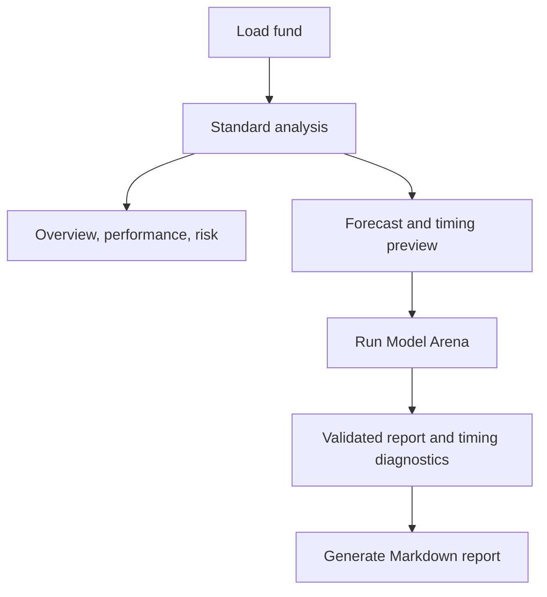

# Desktop Application

The native desktop application is a WinForms research shell over `Aletheia.Application`. It uses the
same analytical services as the CLI and adds navigation, charts, cancellation, fund discovery, a
configurable Model Arena horizon selector, and Markdown report generation.

## Layout

The shell contains:

- a persistent Aletheia/EIDO sidebar;
- grouped analytical destinations;
- a top header with page purpose, dataset metadata, and actions;
- a status bar with application state;
- cards and charts for each analytical page.

The sidebar groups pages into portfolio, research, models, and system areas. See
[Desktop Navigation](../desktop/navigation.md) for the engineering note behind the layout.

## Actions

| Action | Purpose |
| --- | --- |
| `Funds` | Return to fund discovery. |
| `Sample` | Load the deterministic sample dataset. |
| `Open CSV` | Load a local CSV file. |
| `RUN <days>D` | Run Model Arena for the selected calendar-day validation horizon. |
| `Cancel` | Cancel provider, loading, simulation, or Arena work. |

The horizon selector in the header controls the primary Model Arena validation window. It does not
change already-rendered results until the Arena is run again.

## Evidence Flow

## Interpreting Desktop Output

Use the desktop as an evidence workstation. Start with data quality and provenance, then historical
performance/risk, then models, then decision language. The visual hierarchy makes the signal
visible, but the signal is not a replacement for the warnings and validation diagnostics.

!!! danger "No automatic trading"
    The desktop does not connect to a broker and does not execute orders. It displays analytical
    evidence and conservative labels.

## Empty and Warning States

Several pages intentionally show empty states before a dataset is loaded, before Model Arena is run,
or when the prediction ledger has no rows. Empty states are part of the scientific contract: Aletheia
should show missing evidence instead of fabricating it.
