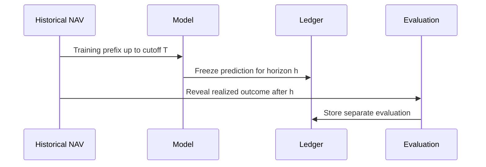

# Walk-Forward Validation

Walk-forward validation evaluates a model as if each historical prediction had been made at the
original cutoff date.

## Process

## Implementation

`WalkForwardEvaluator` creates expanding or rolling splits, passes only the active training window to
each `IForecastModel`, freezes a `PredictionLedgerRecord`, and creates a separate
`PredictionEvaluationRecord` when the realized outcome is available.

Default application options for a loaded history are:

| Option | Default behavior |
| --- | --- |
| Minimum training observations | `min(500, max(60, observation_count / 3))` |
| Forecast horizon | Application default is 90 calendar days unless a horizon is supplied. |
| Step size | `max(1, min(63, observation_count / 40))` |
| Minimum evaluation samples | 10 |
| Calibration bins | 10 |

## Interpretation

Walk-forward validation is stronger than in-sample fit because each prediction is generated from past
data only. It is still historical evidence, not a live track record.

## Failure Modes

- too few observations before the first cutoff;
- target horizon cannot be resolved;
- model reports typed training/prediction failure;
- too few evaluation samples for ranking;
- overlapping outcomes reduce independence.

Related math: [Walk-Forward Validation Notes](../mathematics/validation/walk-forward-validation.md).
